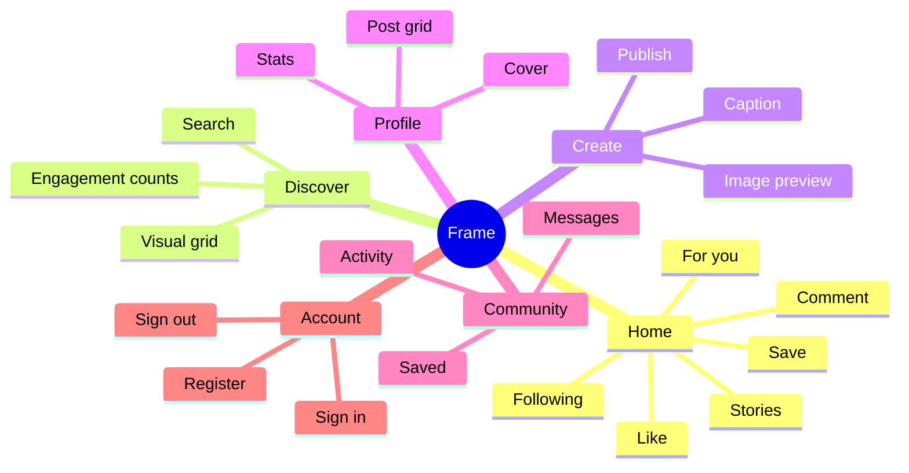
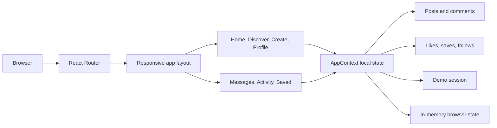
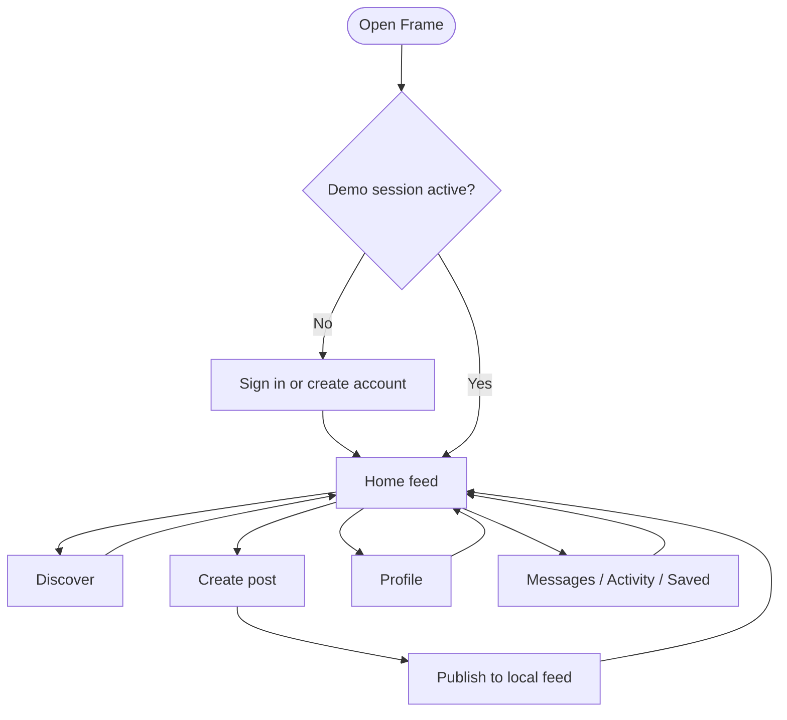
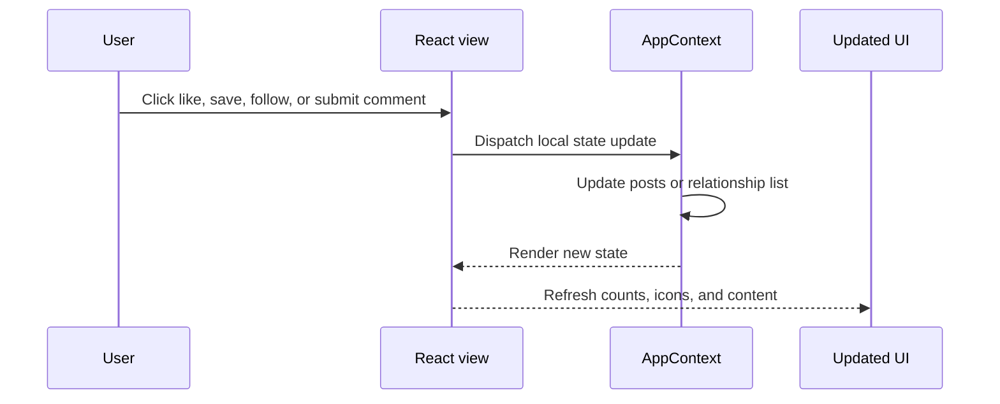
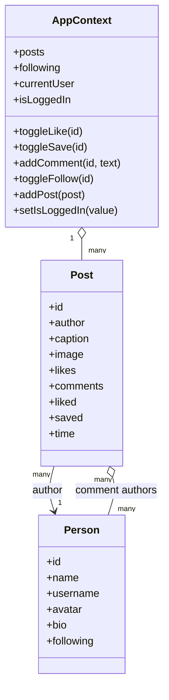
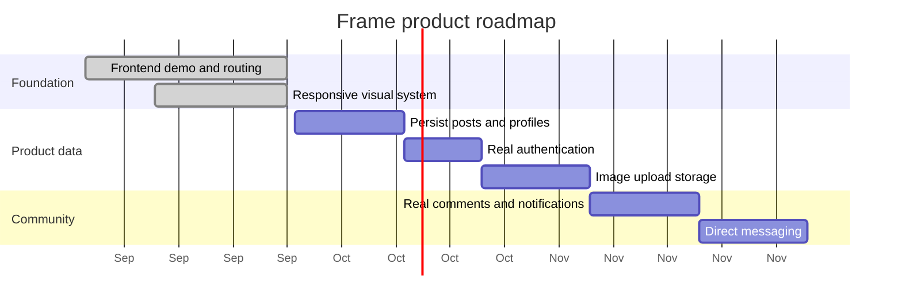

# Frame.

> A calm, visual-first social space for sharing the moments worth keeping.

Frame is an Instagram-inspired social media frontend built with React and Vite. It is currently a fully interactive demo: there is no database, authentication service, or API dependency required to explore the experience. Posts, likes, saves, comments, follows, and new posts are handled with local React state.

<p align="center">
  <a href="http://localhost:5174/"><strong>Open the app locally</strong></a>
  &nbsp;&nbsp;·&nbsp;&nbsp;
  <a href="#getting-started">Getting started</a>
  &nbsp;&nbsp;·&nbsp;&nbsp;
  <a href="#roadmap">Roadmap</a>
</p>

## Preview

### Home feed

The home view combines stories, a two-tab feed, social actions, comments, and a suggestions rail.


### Discover

The Discover route turns posts into an editorial grid for browsing visual content.


> The two supplied browser captures show these same product views: the home feed at `/` and the Discover gallery at `/discover`. To store those exact captures in the repository, add them as `docs/screenshots/home.png` and `docs/screenshots/discover.png`, then replace the image URLs above with local Markdown image links.

## What is included

- **Home feed** with stories, For you / Following tabs, post cards, captions, likes, saves, comments, and sharing controls.
- **Discover gallery** with searchable visual browsing UI and an editorial masonry-style layout.
- **Create post** flow with image preview, image URL input, caption counter, and publish action.
- **Profile** view with cover image, avatar, biography, profile statistics, and post grid.
- **Messages, Activity, and Saved** routes with polished empty states ready for future data.
- **Demo authentication** screen with sign in and account creation states. Any valid-looking form submission enters the demo.
- **Responsive navigation** with a desktop sidebar and mobile bottom tab bar.
- **Local interactions** for liking, saving, commenting, following, publishing, and signing out.

## Product map



## Application architecture

The current implementation intentionally keeps the data layer in the browser. This makes the design easy to review and allows the interface to be demonstrated without MongoDB, environment variables, or a running API.



## User flow



## Route map

| Route | View | Purpose |
| --- | --- | --- |
| `/` | Home | Stories, feed posts, comments, likes, saves, and suggestions |
| `/discover` | Discover | Browse the visual post grid |
| `/create` | Create | Preview an image and publish a new local post |
| `/profile` | Profile | View profile details and the post grid |
| `/messages` | Messages | Conversation placeholder for the next product phase |
| `/activity` | Activity | Notification placeholder for likes, follows, and comments |
| `/saved` | Saved | Saved-content placeholder |

## Interaction model



## State model



## Tech stack

| Layer | Technology |
| --- | --- |
| UI | React 18 |
| Build tool | Vite 6 |
| Routing | React Router |
| Icons | Lucide React |
| Styling | Responsive CSS with custom design tokens |
| Data | Local React state and mock content |
| Media | Unsplash and Pravatar demo URLs |

## Project structure

```text
Social_Media_app/
├── client/
│   ├── index.html
│   ├── package.json
│   └── src/
│       ├── main.jsx       # Routes, pages, mock data, and interactions
│       └── styles.css     # Frame design system and responsive layouts
├── server/                # Optional legacy API, not required for the frontend demo
├── package.json           # Workspace scripts
└── README.md
```

## Getting started

### Requirements

- Node.js 18 or newer
- npm 9 or newer

### Install

```bash
npm install
npm install --prefix client
```

### Run the frontend

```bash
npm run dev --prefix client
```

Vite will print the local URL. In the current workspace, port `5173` was already occupied, so the client opened at:

```text
http://localhost:5174/
```

### Build for production

```bash
npm run build --prefix client
```

### Preview the production build

```bash
npm run preview --prefix client
```

## Demo notes

- No MongoDB setup is needed.
- No backend needs to be running.
- Refreshing the page resets the in-memory demo state.
- The image URLs require an internet connection. The layout and interactions still load without them.
- The existing `server/` folder is retained for future API work, but the current client does not call it.

## Design direction

Frame uses a restrained editorial visual language rather than a dense dashboard treatment:

- Warm paper background with quiet borders and charcoal typography.
- Coral used as a small interaction accent for likes, links, and calls to action.
- Playfair Display for expressive headings and DM Sans for readable interface text.
- Large, image-led content with generous whitespace.
- Desktop sidebar navigation that becomes a compact mobile tab bar.

## Roadmap



## License

This project is a private learning and portfolio project. Add a license before distributing it publicly.
